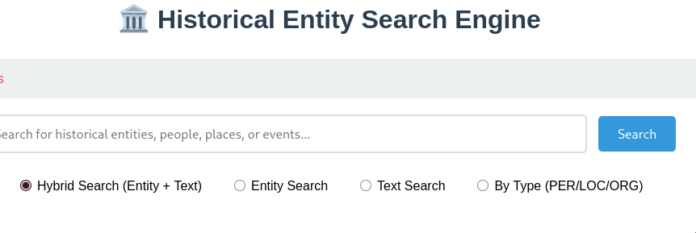

# Vietnamese Historical Entity Search Engine

> A high-performance search engine for Vietnamese historical texts combining Entity (NER), Text (TF-IDF), and Semantic (PhoBERT) retrieval.

---

| Service | Port | Vai trò |
|---|---|---|
| **Main API** | `5000` | Flask backend core handling Entity, Text, and Hybrid search |
| **Web Interface** | `5000` | Built-in search UI (HTML/JS served via Main API) |
| **Semantic API** | `5001` | Standalone PhoBERT-based semantic similarity API |
| **Indexing** | `N/A` | Offline scripts for building FAISS and Entity indexes |

---

## Structure

```
Search-Engine/
├── search_engine/              ← Main search engine module
│   ├── api.py                  ← Flask entry point (Main API + UI)
│   ├── search_core.py          ← Core logic (TF-IDF, Hybrid ranking)
│   ├── entity_indexer.py       ← Entity index builder (NER-based)
│   ├── config.py               ← Search settings & port configuration
│   └── demo.py                 ← Command-line interactive demo
├── semantic_search/            ← Semantic search module
│   ├── semantic_api.py         ← Standalone API (PhoBERT)
│   ├── semantic_indexer.py     ← Vector search logic (FAISS)
│   ├── build_semantic_indexes.py← Script to generate vector embeddings
│   └── config.py               ← Semantic model & API settings
└── Monument_database/          ← Data repository
    ├── merged.csv              ← Combined historical dataset
    ├── processed_vietnamese.py ← Text normalization utilities
    └── vietnamese-stopwords.txt← Custom stopwords list
```

## Demo
<figure>
  <div align="center">
    
  </div>
</figure>

## Important notes

### Model & Indexes
- **PhoBERT**: Semantic search requires `vinai/phobert-base`. The first run will download ~400MB.
- **Data**: Ensure `merged.csv` is correctly placed in `Monument_database/`.
- **Ports**: If running both APIs, ensure they are on different ports (configured in `config.py`).

## Instruction

```bash
# Terminal 1 — Build Entity Index
python search_engine/entity_indexer.py

# Terminal 2 — Build Semantic Index (Requires GPU/CPU)
cd semantic_search && python build_semantic_indexes.py

# Terminal 3 — Main Search API (Entity + Hybrid)
python search_engine/api.py

# Terminal 4 — Semantic Search API
cd semantic_search && python semantic_api.py
```

---

## API Endpoints 

| Method | Endpoint | Mô tả |
|---|---|---|
| `GET` | `/` | Home - Search Web Interface |
| `GET` | `/api/search` | Main search: `q=query`, `type=hybrid/entity/text` |
| `GET` | `/api/suggest` | Autocomplete suggestions for entities |
| `GET` | `/api/stats` | Database statistics (counts, types) |
| `GET` | `/api/semantic/search` | Semantic search endpoint (PhoBERT) |
| `GET` | `/api/health` | Service health check |
| `GET` | `/api/cache/clear` | Clear LRU caches for development |
| `GET` | `/api/entity/{name}` | Detailed information for a specific entity |


